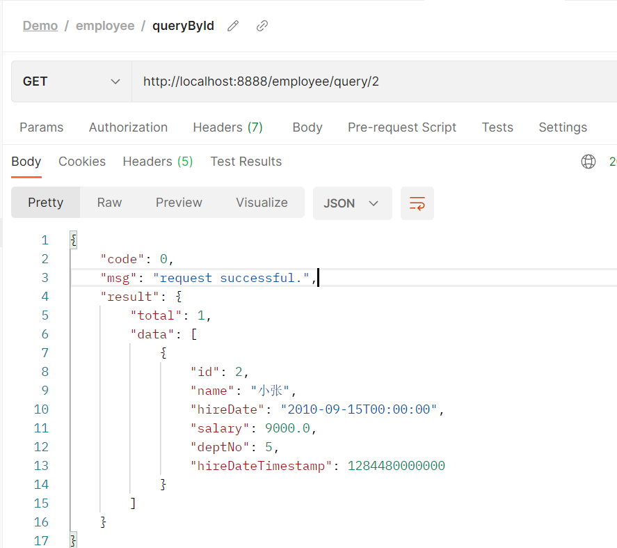

# Spring Boot 学习笔记

## 1. HelloWolrd

从 [Spring Initializr](https://start.spring.io/) 官网生成项目包，选择 web模块。

然后，新建 `HelloController`

```
@RestController
public class HelloController {

    @RequestMapping("/hello")
    @ResponseBody
    public String hello() {
        return "Hello World!";
    }
}
```

在 `DemoApplication` 类中，运行程序：`Run DemoApplication.main()`，在浏览器地址栏输入：`http://localhost:8080/hello` ，就可以看到结果：`Hello World!`。

## 2. 日志 logback.xml 配置

参考：[logback的使用和logback.xml详解](https://www.cnblogs.com/warking/p/5710303.html)

日志输出级别：
根据Level的级别，优先级大的优先输出，优先级从大到小为：
`ERROR>WARN>INFO>DEBUG>TRACE`

logback.xml的例子：

```
<?xml version="1.0" encoding="UTF-8"?>
<configuration>

    <property name="LOG_HOME" value="/Users/youngbear/logs" />
    <property name="PROJECT_NAME" value="springbootdemo" />
    <!-- 控制台输出 -->
    <appender name="STDOUT" class="ch.qos.logback.core.ConsoleAppender">
        <encoder class="ch.qos.logback.classic.encoder.PatternLayoutEncoder">
            <!--格式化输出：%d表示日期，%thread表示线程名，%-5level：级别从左显示5个字符宽度%msg：日志消息，%L表示打印日志所在文件的行数，%n是换行符-->
            <pattern>%d{yyyy-MM-dd HH:mm:ss.SSS} [%thread] %-5level %logger{50}:%L - %msg%n</pattern>
        </encoder>
    </appender>
    <!-- 输出到文件 -->
    <appender name="FILE"  class="ch.qos.logback.core.rolling.RollingFileAppender">
        <!-- file 标签用来表示当前日志的文件，如果没有改标签的话，则使用FileNamePattern中的配置 -->
        <file>${LOG_HOME}/${PROJECT_NAME}/springbootdemo.log</file>
        <rollingPolicy class="ch.qos.logback.core.rolling.TimeBasedRollingPolicy">
            <!--日志文件输出的文件名-->
            <FileNamePattern>${LOG_HOME}/${PROJECT_NAME}/springbootdemo.%d{yyyy-MM-dd}.log</FileNamePattern>
            <!--日志文件保留天数-->
            <MaxHistory>15</MaxHistory>
        </rollingPolicy>
        <encoder class="ch.qos.logback.classic.encoder.PatternLayoutEncoder">
            <!--格式化输出：%d表示日期，%thread表示线程名，%-5level：级别从左显示5个字符宽度%msg：日志消息，%L表示打印日志所在文件的行数，%n是换行符-->
            <pattern>%d{yyyy-MM-dd HH:mm:ss.SSS} [%thread] %-5level %logger{50}:%L - %msg%n</pattern>
        </encoder>
        <!--日志文件最大的大小-->
        <triggeringPolicy class="ch.qos.logback.core.rolling.SizeBasedTriggeringPolicy">
            <MaxFileSize>50MB</MaxFileSize>
        </triggeringPolicy>
    </appender>

    <!-- 日志输出级别 -->
    <root level="INFO">
        <appender-ref ref="STDOUT" />
        <appender-ref ref="FILE" />
    </root>
</configuration>
```

访问时，日志输出为：

```
2018-11-28 23:14:50.237 [http-nio-8080-exec-1] INFO  com.example.demo.controller.HelloController - info Hello
2018-11-28 23:14:50.246 [http-nio-8080-exec-1] WARN  com.example.demo.controller.HelloController - warn Hello
2018-11-28 23:14:50.247 [http-nio-8080-exec-1] ERROR com.example.demo.controller.HelloController - error Hello
```

## 3. 返回 Json 串

使用 `@RestController`:

```
@RestController
@RequestMapping("/v1/book")
public class BookController {

    @RequestMapping(value = "/books", method = RequestMethod.POST,
            produces = "application/json;charset=UTF-8")
    public List<Book> test() {
        List<Book> books = new ArrayList<>();
        Book b1 = new Book();
        b1.setName("数学之美");
        b1.setPublisher("人民邮电出版社");
        b1.setAuther("吴军");
        Book b2 = new Book();
        b2.setName("重构 改善既有代码的设计");
        b2.setPublisher("人民邮电出版社");
        b2.setAuther("Martin Fowler");
        Book b3 = new Book();
        b3.setName("机器学习实战");
        b3.setPublisher("人民邮电出版社");
        b3.setAuther("Peter Harrington");
        Book b4 = new Book();
        b4.setName("Effective Java中文版");
        b4.setPublisher("机械工业出版社");
        b4.setAuther("Joshua Bloch");
        books.add(b1);
        books.add(b2);
        books.add(b3);
        books.add(b4);
        return books;
    }

}
```

使用 curl 访问：

```
192:SpringBootDemo youngbear$ curl http://localhost:8080/v1/book/books -X POST
[{"name":"数学之美","publisher":"人民邮电出版社","author":"吴军"},{"name":"重构 改善既有代码的设计","publisher":"人民邮电出版社","author":"Martin Fowler"},{"name":"机器学习实战","publisher":"人民邮电出版社","author":"Peter Harrington"},{"name":"Effective Java中文版","publisher":"机械工业出版社","author":"Joshua Bloch"}]
```


## 4. 使用 Tomcat 部署

### 4.1 设置打包为 war

`<packaging>war</packaging>`

### 4.2 设置 war 包的名称

`<finalName>Demo</finalName>`


详细配置如下：

```xml
<?xml version="1.0" encoding="UTF-8"?>
<project xmlns="http://maven.apache.org/POM/4.0.0" xmlns:xsi="http://www.w3.org/2001/XMLSchema-instance"
         xsi:schemaLocation="http://maven.apache.org/POM/4.0.0 http://maven.apache.org/xsd/maven-4.0.0.xsd">
    <modelVersion>4.0.0</modelVersion>

    <groupId>com.example</groupId>
    <artifactId>demo</artifactId>
    <version>0.0.1-SNAPSHOT</version>
    <packaging>war</packaging>

    <name>demo</name>
    <description>Demo project for Spring Boot</description>

    <parent>
        <groupId>org.springframework.boot</groupId>
        <artifactId>spring-boot-starter-parent</artifactId>
        <version>2.1.0.RELEASE</version>
        <relativePath/> <!-- lookup parent from repository -->
    </parent>

    <properties>
        <project.build.sourceEncoding>UTF-8</project.build.sourceEncoding>
        <project.reporting.outputEncoding>UTF-8</project.reporting.outputEncoding>
        <java.version>1.8</java.version>
    </properties>

    <dependencies>
        <dependency>
            <groupId>org.springframework.boot</groupId>
            <artifactId>spring-boot-starter-web</artifactId>
        </dependency>

        <dependency>
            <groupId>org.springframework.boot</groupId>
            <artifactId>spring-boot-starter-test</artifactId>
            <scope>test</scope>
        </dependency>
    </dependencies>

    <build>
        <plugins>
            <plugin>
                <groupId>org.springframework.boot</groupId>
                <artifactId>spring-boot-maven-plugin</artifactId>
            </plugin>
        </plugins>
        <finalName>Demo</finalName>
    </build>


</project>

```

### 4.3 配置 Application

```java
package com.example.demo;

import org.springframework.boot.SpringApplication;
import org.springframework.boot.autoconfigure.SpringBootApplication;
import org.springframework.boot.builder.SpringApplicationBuilder;
import org.springframework.boot.web.servlet.support.SpringBootServletInitializer;

@SpringBootApplication
public class DemoApplication extends SpringBootServletInitializer {

    public static void main(String[] args) {
        SpringApplication.run(DemoApplication.class, args);
    }

    @Override
    protected SpringApplicationBuilder configure(SpringApplicationBuilder builder) {
        return builder.sources(DemoApplication.class);
    }
}
```

### 4.4 配置 tomcat (可选)

配置端口：

tomcat 默认端口为8080，如果需要更改，则在tomcat安装目录/conf/server.xml中，更改 `<Connector` 标签的 port 属性即可。如下，我们将tomcat端口改为9090：


```xml
<?xml version='1.0' encoding='utf-8'?>
<!--
  Licensed to the Apache Software Foundation (ASF) under one or more
  contributor license agreements.  See the NOTICE file distributed with
  this work for additional information regarding copyright ownership.
  The ASF licenses this file to You under the Apache License, Version 2.0
  (the "License"); you may not use this file except in compliance with
  the License.  You may obtain a copy of the License at

      http://www.apache.org/licenses/LICENSE-2.0

  Unless required by applicable law or agreed to in writing, software
  distributed under the License is distributed on an "AS IS" BASIS,
  WITHOUT WARRANTIES OR CONDITIONS OF ANY KIND, either express or implied.
  See the License for the specific language governing permissions and
  limitations under the License.
-->
<!-- Note:  A "Server" is not itself a "Container", so you may not
     define subcomponents such as "Valves" at this level.
     Documentation at /docs/config/server.html
 -->
<Server port="8005" shutdown="SHUTDOWN">
  <Listener className="org.apache.catalina.startup.VersionLoggerListener" />
  <!-- Security listener. Documentation at /docs/config/listeners.html
  <Listener className="org.apache.catalina.security.SecurityListener" />
  -->
  <!--APR library loader. Documentation at /docs/apr.html -->
  <Listener className="org.apache.catalina.core.AprLifecycleListener" SSLEngine="on" />
  <!-- Prevent memory leaks due to use of particular java/javax APIs-->
  <Listener className="org.apache.catalina.core.JreMemoryLeakPreventionListener" />
  <Listener className="org.apache.catalina.mbeans.GlobalResourcesLifecycleListener" />
  <Listener className="org.apache.catalina.core.ThreadLocalLeakPreventionListener" />

  <!-- Global JNDI resources
       Documentation at /docs/jndi-resources-howto.html
  -->
  <GlobalNamingResources>
    <!-- Editable user database that can also be used by
         UserDatabaseRealm to authenticate users
    -->
    <Resource name="UserDatabase" auth="Container"
              type="org.apache.catalina.UserDatabase"
              description="User database that can be updated and saved"
              factory="org.apache.catalina.users.MemoryUserDatabaseFactory"
              pathname="conf/tomcat-users.xml" />
  </GlobalNamingResources>

  <!-- A "Service" is a collection of one or more "Connectors" that share
       a single "Container" Note:  A "Service" is not itself a "Container",
       so you may not define subcomponents such as "Valves" at this level.
       Documentation at /docs/config/service.html
   -->
  <Service name="Catalina">

    <!--The connectors can use a shared executor, you can define one or more named thread pools-->
    <!--
    <Executor name="tomcatThreadPool" namePrefix="catalina-exec-"
        maxThreads="150" minSpareThreads="4"/>
    -->


    <!-- A "Connector" represents an endpoint by which requests are received
         and responses are returned. Documentation at :
         Java HTTP Connector: /docs/config/http.html (blocking & non-blocking)
         Java AJP  Connector: /docs/config/ajp.html
         APR (HTTP/AJP) Connector: /docs/apr.html
         Define a non-SSL/TLS HTTP/1.1 Connector on port 8080
    -->
    <Connector port="9090" protocol="HTTP/1.1"
               connectionTimeout="20000"
               redirectPort="8443" />
    <!-- A "Connector" using the shared thread pool-->
    <!--
    <Connector executor="tomcatThreadPool"
               port="8080" protocol="HTTP/1.1"
               connectionTimeout="20000"
               redirectPort="8443" />
    -->
    <!-- Define a SSL/TLS HTTP/1.1 Connector on port 8443
         This connector uses the NIO implementation that requires the JSSE
         style configuration. When using the APR/native implementation, the
         OpenSSL style configuration is required as described in the APR/native
         documentation -->
    <!--
    <Connector port="8443" protocol="org.apache.coyote.http11.Http11NioProtocol"
               maxThreads="150" SSLEnabled="true" scheme="https" secure="true"
               clientAuth="false" sslProtocol="TLS" />
    -->

    <!-- Define an AJP 1.3 Connector on port 8009 -->
    <Connector port="8009" protocol="AJP/1.3" redirectPort="8443" />


    <!-- An Engine represents the entry point (within Catalina) that processes
         every request.  The Engine implementation for Tomcat stand alone
         analyzes the HTTP headers included with the request, and passes them
         on to the appropriate Host (virtual host).
         Documentation at /docs/config/engine.html -->

    <!-- You should set jvmRoute to support load-balancing via AJP ie :
    <Engine name="Catalina" defaultHost="localhost" jvmRoute="jvm1">
    -->
    <Engine name="Catalina" defaultHost="localhost">

      <!--For clustering, please take a look at documentation at:
          /docs/cluster-howto.html  (simple how to)
          /docs/config/cluster.html (reference documentation) -->
      <!--
      <Cluster className="org.apache.catalina.ha.tcp.SimpleTcpCluster"/>
      -->

      <!-- Use the LockOutRealm to prevent attempts to guess user passwords
           via a brute-force attack -->
      <Realm className="org.apache.catalina.realm.LockOutRealm">
        <!-- This Realm uses the UserDatabase configured in the global JNDI
             resources under the key "UserDatabase".  Any edits
             that are performed against this UserDatabase are immediately
             available for use by the Realm.  -->
        <Realm className="org.apache.catalina.realm.UserDatabaseRealm"
               resourceName="UserDatabase"/>
      </Realm>

      <Host name="localhost"  appBase="webapps"
            unpackWARs="true" autoDeploy="true">

        <!-- SingleSignOn valve, share authentication between web applications
             Documentation at: /docs/config/valve.html -->
        <!--
        <Valve className="org.apache.catalina.authenticator.SingleSignOn" />
        -->

        <!-- Access log processes all example.
             Documentation at: /docs/config/valve.html
             Note: The pattern used is equivalent to using pattern="common" -->
        <Valve className="org.apache.catalina.valves.AccessLogValve" directory="logs"
               prefix="localhost_access_log" suffix=".txt"
               pattern="%h %l %u %t &quot;%r&quot; %s %b" />

      </Host>
    </Engine>
  </Service>
</Server>

```

### 4.5 构建包

`mvn package`

### 4.6 部署

将 war 包拷贝到tomcat的 `/webapps/` 目录下，重启tomcat：

```shell
# 拷贝 war 包
192:apache-tomcat-8.0.46 youngbear$ pwd
/Users/youngbear/setup/apache-tomcat-8.0.46
192:apache-tomcat-8.0.46 youngbear$ cp ~/IdeaProjects/SpringBootDemo/target/Demo.war webapps/
# 重启 tomcat
192:apache-tomcat-8.0.46 youngbear$ cd bin/
192:bin youngbear$ ./shutdown.sh
Using CATALINA_BASE:   /Users/youngbear/setup/apache-tomcat-8.0.46
Using CATALINA_HOME:   /Users/youngbear/setup/apache-tomcat-8.0.46
Using CATALINA_TMPDIR: /Users/youngbear/setup/apache-tomcat-8.0.46/temp
Using JRE_HOME:        /Library/Java/JavaVirtualMachines/jdk1.8.0_73.jdk/Contents/Home
Using CLASSPATH:       /Users/youngbear/setup/apache-tomcat-8.0.46/bin/bootstrap.jar:/Users/youngbear/setup/apache-tomcat-8.0.46/bin/tomcat-juli.jar

192:bin youngbear$ ./startup.sh
Using CATALINA_BASE:   /Users/youngbear/setup/apache-tomcat-8.0.46
Using CATALINA_HOME:   /Users/youngbear/setup/apache-tomcat-8.0.46
Using CATALINA_TMPDIR: /Users/youngbear/setup/apache-tomcat-8.0.46/temp
Using JRE_HOME:        /Library/Java/JavaVirtualMachines/jdk1.8.0_73.jdk/Contents/Home
Using CLASSPATH:       /Users/youngbear/setup/apache-tomcat-8.0.46/bin/bootstrap.jar:/Users/youngbear/setup/apache-tomcat-8.0.46/bin/tomcat-juli.jar
Tomcat started.
192:bin youngbear$

```

### 4.7 访问接口

**注意：**

使用 `tomcat` 的部署方式，在访问接口时，url 需要加上上下文，即 War 包的名称，部署成功时，/webapps/下会生成一个与 war 包同名的目录，访问时需要带上，如：

```shell
# 使用 SpringBoot 的jar包启动时的访问
192:SpringBootDemo youngbear$ curl http://localhost:8080/hello -X GET
Hello World!
# 使用 tomcat 部署时的访问
192:SpringBootDemo youngbear$ curl http://localhost:9090/Demo/hello -X GET
Hello World!
```


## 5. Swagger-ui

### 5.1 配置 pom 依赖

```xml
        <dependency>
            <groupId>io.springfox</groupId>
            <artifactId>springfox-swagger2</artifactId>
            <version>${springfox.version}</version>
        </dependency>

        <dependency>
            <groupId>io.springfox</groupId>
            <artifactId>springfox-swagger-ui</artifactId>
            <version>${springfox.version}</version>
        </dependency>
```

### 5.2 添加 Swagger-ui 配置类

```java
package com.example.demo.configuration;

import org.springframework.context.annotation.Bean;
import org.springframework.context.annotation.Configuration;
import springfox.documentation.builders.ApiInfoBuilder;
import springfox.documentation.builders.PathSelectors;
import springfox.documentation.builders.RequestHandlerSelectors;
import springfox.documentation.service.ApiInfo;
import springfox.documentation.service.Contact;
import springfox.documentation.spi.DocumentationType;
import springfox.documentation.spring.web.plugins.Docket;
import springfox.documentation.swagger2.annotations.EnableSwagger2;

/**
 * @author youngbear
 * @email youngbear@aliyun.com
 * @date 2019/3/24 10:10
 * @blog https://blog.csdn.net/next_second
 * @github https://github.com/YoungBear
 * @description Swagger ui 配置类
 */
@Configuration
@EnableSwagger2
public class SwaggerConfiguration {


    /**
     * 创建API应用
     * apiInfo() 增加API相关信息
     * 通过select()函数返回一个ApiSelectorBuilder实例,用来控制哪些接口暴露给Swagger来展现，
     * 本例采用指定扫描的包路径来定义指定要建立API的目录。
     *
     * @return
     */
    @Bean
    public Docket createRestApi() {
        return new Docket(DocumentationType.SWAGGER_2)
                .apiInfo(apiInfo())
                .select()
                .apis(RequestHandlerSelectors.basePackage("com.example.demo.controller"))
                .paths(PathSelectors.any())
                .build();
    }

    /**
     * 创建该API的基本信息（这些基本信息会展现在文档页面中）
     * 访问地址：http://项目实际地址/swagger-ui.html
     * @return
     */
    private ApiInfo apiInfo() {
        return new ApiInfoBuilder()
                .title("Spring Boot 学习之路- Swagger UI")
                .description("https://github.com/YoungBear/SpringBootDemo")
                .version("1.0")
                .contact(new Contact("ysx",
                        "https://blog.csdn.net/next_second",
                        "youngbear@aliyun.com"))
                .build();
    }

}

```

### 5.3 使用注解添加接口描述

- `@Api` 注解在接口类上，描述类的功能。
- `@ApiOperation` 注解在方法上，描述方法的功能。
- `@ApiModel` 注解在类上，一般是请求或者返回实体类。
- `ApiModelProperty` 注解在属性上，用于描述实体的属性。


eg.

```java
package com.example.demo.controller;

import io.swagger.annotations.Api;
import io.swagger.annotations.ApiOperation;
import org.slf4j.Logger;
import org.slf4j.LoggerFactory;
import org.springframework.web.bind.annotation.RequestMapping;
import org.springframework.web.bind.annotation.RequestMethod;
import org.springframework.web.bind.annotation.ResponseBody;
import org.springframework.web.bind.annotation.RestController;

/**
 * @author youngbear
 * @email youngbear@aliyun.com
 * @date 2018/11/28 21:55
 * @blog https://blog.csdn.net/next_second
 * @github https://github.com/YoungBear
 * @description
 */
@RestController
@Api("Hello 测试接口")
public class HelloController {
    private static final Logger LOGGER = LoggerFactory.getLogger(HelloController.class);

    @RequestMapping(value = hi, method = RequestMethod.GET)
    @ResponseBody
    @ApiOperation(hi)
    public String hello() {
        LOGGER.trace("trace Hello");
        LOGGER.debug("debug Hello");
        LOGGER.info("info Hello");
        LOGGER.warn("warn Hello");
        LOGGER.error("error Hello");
        return "Hello World!";
    }
}

```


### 5.4 接口地址：

如果使用 SpringBoot jar包方式启动，则文档地址为：

http://localhost:8080/swagger-ui.html

(默认端口为8080)

如果使用 tomcat 部署启动，则文档地址为：

http://localhost:9090/Demo/swagger-ui.html


### 5.5 生产环境不显示Swagger-UI

在Swagger-UI的配置类`SwaggerConfiguration`中，对类添加注解：

```java
@Profile({"dev", "test"})
```

表示只在dev和test环境显示Swagger-UI，在其他环境不显示。

## 6. 返回统一的json格式

### 6.1 创建返回对象泛型类

统一对象类： `Result.java`

```java
package com.example.demo.entity.common;

/**
 * @author youngbear
 * @email youngbear@aliyun.com
 * @date 2019-04-30 21:38
 * @blog https://blog.csdn.net/next_second
 * @github https://github.com/YoungBear
 * @description 统一返回json格式
 */
public class Result<T> {

    /**
     * 错误码
     */
    private Integer code;

    /**
     * 提示信息
     */
    private String msg;

    /**
     * 数据
     */
    private ResultBean<T> result;

    // 省略 getter 和 setter 方法
}
```

其中，`ResultBean`的定义为：

`ResultBean.java`

```java
package com.example.demo.entity.common;

import java.util.List;

/**
 * @author youngbear
 * @email youngbear@aliyun.com
 * @date 2019-04-30 22:51
 * @blog https://blog.csdn.net/next_second
 * @github https://github.com/YoungBear
 * @description
 */
public class ResultBean<T> {

    private Integer total;
    private List<T> data;

    // 省略 getter 和 setter 方法
}
```

### 6.2 创建异常类

错误定义枚举：`ErrorEnum.java`

```java
package com.example.demo.enums;

/**
 * @author youngbear
 * @email youngbear@aliyun.com
 * @date 2019-04-30 22:35
 * @blog https://blog.csdn.net/next_second
 * @github https://github.com/YoungBear
 * @description
 */
public enum ErrorEnum {

    BOOK_NAME_NULL_ERROR(10001, "book name is null."),
    HELLO_NAME_NULL_ERROR(20001, "hi name is null.")
    ;


    Integer errorCode;
    String errorMessage;

    ErrorEnum(Integer errorCode, String errorMessage) {
        this.errorCode = errorCode;
        this.errorMessage = errorMessage;
    }

    public Integer getErrorCode() {
        return errorCode;
    }

    public String getErrorMessage() {
        return errorMessage;
    }
}
```

异常类：`DemoException.java`

```java
package com.example.demo.exception;

import com.example.demo.enums.ErrorEnum;

/**
 * @author youngbear
 * @email youngbear@aliyun.com
 * @date 2019-04-30 22:31
 * @blog https://blog.csdn.net/next_second
 * @github https://github.com/YoungBear
 * @description 统一异常
 */
public class DemoException extends RuntimeException {

    private final ErrorEnum errorEnum;

    public DemoException(ErrorEnum errorEnum) {
        this.errorEnum = errorEnum;
    }

    public ErrorEnum getErrorEnum() {
        return errorEnum;
    }
}
```

### 6.3 创建工具类

创建工具类 `ResultUtils.java` ，进行封装返回成功信息，异常信息。

```java
package com.example.demo.utils;

import com.example.demo.entity.common.Result;
import com.example.demo.entity.common.ResultBean;
import com.example.demo.enums.ErrorEnum;
import com.example.demo.exception.DemoException;

import java.util.ArrayList;
import java.util.List;

/**
 * @author youngbear
 * @email youngbear@aliyun.com
 * @date 2019-04-30 22:19
 * @blog https://blog.csdn.net/next_second
 * @github https://github.com/YoungBear
 * @description
 */
public class ResultUtils {

    /**
     * 成功返回
     *
     * @param data 返回数据
     * @param <T>  数据类型
     * @return 统一的返回值
     */
    public static <T> Result<T> success(T data) {
        Result<T> result = new Result<>();
        result.setCode(0);
        result.setMsg("request successful.");
        ResultBean<T> resultBean = new ResultBean<>();
        resultBean.setTotal(1);
        List<T> dataList = new ArrayList<>(1);
        dataList.add(data);
        resultBean.setData(dataList);
        result.setResult(resultBean);
        return result;
    }

    public static <T> Result<T> success(List<T> dataList){
        Result<T> result = new Result<>();
        result.setCode(0);
        result.setMsg("request successful.");
        ResultBean<T> resultBean = new ResultBean<>();
        resultBean.setTotal(dataList.size());
        resultBean.setData(dataList);
        result.setResult(resultBean);
        return result;
    }
    /**
     * 异常返回
     *
     * @param demoException
     * @param <T>
     * @return
     */
    public static <T> Result<T> error(DemoException demoException) {
        Result<T> result = new Result<>();
        result.setCode(demoException.getErrorEnum().getErrorCode());
        result.setMsg(demoException.getErrorEnum().getErrorMessage());
        return result;
    }

    /**
     * 异常返回
     * @param errorEnum
     * @param <T>
     * @return
     */
    public static <T> Result<T> error(ErrorEnum errorEnum) {
        Result<T> result = new Result<>();
        result.setCode(errorEnum.getErrorCode());
        result.setMsg(errorEnum.getErrorMessage());
        return result;
    }
}
```

### 6.4 实践

以 `BookController` 为例，进行正常返回对象，正常返回数组，异常返回。

```java
package com.example.demo.controller;

import com.example.demo.entity.Book;
import com.example.demo.entity.common.Result;
import com.example.demo.exception.DemoException;
import com.example.demo.service.IBookService;
import com.example.demo.utils.ResultUtils;
import io.swagger.annotations.Api;
import io.swagger.annotations.ApiOperation;
import org.springframework.beans.factory.annotation.Autowired;
import org.springframework.http.MediaType;
import org.springframework.web.bind.annotation.RequestBody;
import org.springframework.web.bind.annotation.RequestMapping;
import org.springframework.web.bind.annotation.RequestMethod;
import org.springframework.web.bind.annotation.RestController;

import java.util.List;

/**
 * @author youngbear
 * @email youngbear@aliyun.com
 * @date 2018/12/10 23:07
 * @blog https://blog.csdn.net/next_second
 * @github https://github.com/YoungBear
 * @description
 */
@RestController
@RequestMapping(value = "/v1/book", produces = MediaType.APPLICATION_JSON_UTF8_VALUE)
@Api("Book 接口")
public class BookController {

    @Autowired
    private IBookService bookService;

    @RequestMapping(value = "/book-list", method = RequestMethod.POST)
    @ApiOperation("返回测试的 book 列表")
    public Result<Book> bookList() {
        try {
            List<Book> books = bookService.bookList();
            return ResultUtils.success(books);
        } catch (DemoException demoException) {
            return ResultUtils.error(demoException);
        }

    }

    @RequestMapping(value = "one-book", method = RequestMethod.POST)
    public Result<Book> oneBook(@RequestBody Book book) {
        try {
            Book book1 = bookService.oneBook(book.getName(), book.getAuther(), book.getPublisher());
            return ResultUtils.success(book1);
        } catch (DemoException demoException) {
            return ResultUtils.error(demoException);
        }
    }

}
```

**对应`IService`文件：`IBookService.java`**

```java
package com.example.demo.service;

import com.example.demo.entity.Book;

import java.util.List;

/**
 * @author youngbear
 * @email youngbear@aliyun.com
 * @date 2019-04-30 23:01
 * @blog https://blog.csdn.net/next_second
 * @github https://github.com/YoungBear
 * @description
 */
public interface IBookService {

    /**
     * 返回测试列表
     * @return
     */
    List<Book> bookList();

    /**
     * 构造一个书的对象
     * @param name
     * @param author
     * @param publisher
     * @return
     */
    Book oneBook(String name, String author, String publisher);

}

```

**Service实现类：`BookServiceImpl.java`**

```java
package com.example.demo.service.impl;

import com.example.demo.entity.Book;
import com.example.demo.exception.DemoException;
import com.example.demo.service.IBookService;
import org.springframework.stereotype.Service;

import java.util.ArrayList;
import java.util.List;

import static com.example.demo.enums.ErrorEnum.BOOK_NAME_NULL_ERROR;

/**
 * @author youngbear
 * @email youngbear@aliyun.com
 * @date 2019-04-30 23:05
 * @blog https://blog.csdn.net/next_second
 * @github https://github.com/YoungBear
 * @description
 */
@Service
public class BookServiceImpl implements IBookService {
    @Override
    public List<Book> bookList() {
        List<Book> books = new ArrayList<>();
        Book b1 = new Book();
        b1.setName("数学之美");
        b1.setPublisher("人民邮电出版社");
        b1.setAuther("吴军");
        Book b2 = new Book();
        b2.setName("重构 改善既有代码的设计");
        b2.setPublisher("人民邮电出版社");
        b2.setAuther("Martin Fowler");
        Book b3 = new Book();
        b3.setName("机器学习实战");
        b3.setPublisher("人民邮电出版社");
        b3.setAuther("Peter Harrington");
        Book b4 = new Book();
        b4.setName("Effective Java中文版");
        b4.setPublisher("机械工业出版社");
        b4.setAuther("Joshua Bloch");
        books.add(b1);
        books.add(b2);
        books.add(b3);
        books.add(b4);
        return books;
    }

    @Override
    public Book oneBook(String name, String author, String publisher) {
        if (null == name) {
            throw new DemoException(BOOK_NAME_NULL_ERROR);
        }
        Book book = new Book();
        book.setName(name);
        book.setAuther(author);
        book.setPublisher(publisher);
        return book;
    }
}

```


#### 1. 获取列表

**请求：**

```shell
curl -X POST "http://localhost:8080/v1/book/book-list" -H  "accept: application/json;charset=UTF-8"
```

**对应返回值：**

```json
{
  "code": 0,
  "msg": "request successful.",
  "result": {
    "total": 4,
    "data": [
      {
        "name": "数学之美",
        "publisher": "人民邮电出版社",
        "author": "吴军"
      },
      {
        "name": "重构 改善既有代码的设计",
        "publisher": "人民邮电出版社",
        "author": "Martin Fowler"
      },
      {
        "name": "机器学习实战",
        "publisher": "人民邮电出版社",
        "author": "Peter Harrington"
      },
      {
        "name": "Effective Java中文版",
        "publisher": "机械工业出版社",
        "author": "Joshua Bloch"
      }
    ]
  }
}
```

#### 2. 生成单个对象

**请求：**

```shell
curl -X POST "http://localhost:8080/v1/book/one-book" -H  "accept: application/json;charset=UTF-8" -H  "Content-Type: application/json" -d "{  \"author\": \"毛泽东\",  \"name\": \"毛泽东选集\",  \"publisher\": \"人民出版社\"}"
```

**返回结果：**

```json
{
  "code": 0,
  "msg": "request successful.",
  "result": {
    "total": 1,
    "data": [
      {
        "name": "毛泽东选集",
        "publisher": "人民出版社",
        "author": "毛泽东"
      }
    ]
  }
}
```

#### 3. 返回异常信息：

**请求：**

```shell
curl -X POST "http://localhost:8080/v1/book/one-book" -H  "accept: application/json;charset=UTF-8" -H  "Content-Type: application/json" -d "{  \"author\": \"毛泽东\",  \"publisher\": \"人民出版社\"}"
```

**返回结果：**

```json
{
  "code": 10001,
  "msg": "book name is null.",
  "result": null
}
```

用postman请求也可以实现同样的效果。具体可参考源代码。

## 7. 处理全局异常

使用注解 `@RestControllerAdvice`，处理全局异常，在请求发生异常时，会通过该类进行处理：

```java
package com.example.demo.configuration;

import com.example.demo.entity.common.Result;
import com.example.demo.enums.ErrorEnum;
import com.example.demo.exception.DemoException;
import com.example.demo.utils.ResultUtils;
import org.slf4j.Logger;
import org.slf4j.LoggerFactory;
import org.springframework.web.bind.annotation.ExceptionHandler;
import org.springframework.web.bind.annotation.RestControllerAdvice;

/**
 * @author youngbear
 * @email youngbear@aliyun.com
 * @date 2019-05-04 21:53
 * @blog https://blog.csdn.net/next_second
 * @github https://github.com/YoungBear
 * @description 全局异常处理
 */

@RestControllerAdvice
public class GlobalExceptionHandler {

    private static final Logger LOGGER = LoggerFactory.getLogger(GlobalExceptionHandler.class);

    // 未知异常
    @ExceptionHandler(value = Exception.class)
    public Result<String> defaultErrorHandler(Exception e) {
        LOGGER.error(e.getMessage(),e);
        return ResultUtils.error(ErrorEnum.UNKNOWN_ERROR);
    }

    // 自定义的异常
    @ExceptionHandler(value = DemoException.class)
    public Result<String> errorHandler(DemoException e) {
        LOGGER.error(e.getMessage(),e);
        return ResultUtils.error(e.getErrorEnum());
    }
}

```


## 8. 解析通用数据格式的json串

一般我们使用通用的json时，微服务之间的调用，会涉及到json的解析，这时候需要传入一个Class对象，既可以解析出来整个的对象：

```java
    /**
     * Gson 解析通用数据格式
     * @param json
     * @param clazz
     * @param <T>
     * @return
     */
    public static <T> Result<T> parseString(String json, Class<T> clazz) {
        //...
    }
```

具体实现方案：

### 8.1 使用Gson依赖：

```xml
<dependency>
    <groupId>com.google.code.gson</groupId>
    <artifactId>gson</artifactId>
    <version>2.8.5</version>
</dependency>
```

### 8.2 Java 代码

```java
package com.example.demo.utils;

import java.lang.reflect.ParameterizedType;
import java.lang.reflect.Type;

/**
 * @author youngbear
 * @email youngbear@aliyun.com
 * @date 2019-05-14 22:47
 * @blog https://blog.csdn.net/next_second
 * @github https://github.com/YoungBear
 * @description
 */
public class ParameterizedTypeImpl implements ParameterizedType {
    private final Class raw;
    private final Type[] args;

    public ParameterizedTypeImpl(Class raw, Type[] args) {
        this.raw = raw;
        this.args = args != null ? args : new Type[0];
    }

    @Override
    public Type[] getActualTypeArguments() {
        return args;
    }

    @Override
    public Type getRawType() {
        return raw;
    }

    @Override
    public Type getOwnerType() {
        return null;
    }
}
```


```java
package com.example.demo.utils;

import com.example.demo.entity.common.Result;
import com.google.gson.Gson;

import java.lang.reflect.Type;

/**
 * @author youngbear
 * @email youngbear@aliyun.com
 * @date 2019-05-14 22:44
 * @blog https://blog.csdn.net/next_second
 * @github https://github.com/YoungBear
 * @description Gson 工具类
 */
public class GsonUtils {
    private static final Gson GSON = new Gson();

    /**
     * Gson 解析通用数据格式
     * @param json
     * @param clazz
     * @param <T>
     * @return
     */
    public static <T> Result<T> parseString(String json, Class<T> clazz) {
        Type type = new ParameterizedTypeImpl(Result.class, new Class[]{clazz});
        Result<T> result = GSON.fromJson(json, type);
        return result;
    }
}
```

### 8.3 单元测试

```java
package com.example.demo.utils;

import com.example.demo.entity.Book;
import com.example.demo.entity.common.Result;
import org.junit.Assert;
import org.junit.Test;

import java.util.List;

/**
 * @author youngbear
 * @email youngbear@aliyun.com
 * @date 2019-05-14 22:54
 * @blog https://blog.csdn.net/next_second
 * @github https://github.com/YoungBear
 * @description Gson 工具类测试
 */
public class GsonUtilsTest {

    @Test
    public void parseStringTest() {
        String json = "{\n" +
                "  \"code\": 0,\n" +
                "  \"msg\": \"request successful.\",\n" +
                "  \"result\": {\n" +
                "    \"total\": 4,\n" +
                "    \"data\": [\n" +
                "      {\n" +
                "        \"name\": \"数学之美\",\n" +
                "        \"publisher\": \"人民邮电出版社\",\n" +
                "        \"author\": \"吴军\"\n" +
                "      },\n" +
                "      {\n" +
                "        \"name\": \"重构 改善既有代码的设计\",\n" +
                "        \"publisher\": \"人民邮电出版社\",\n" +
                "        \"author\": \"Martin Fowler\"\n" +
                "      },\n" +
                "      {\n" +
                "        \"name\": \"机器学习实战\",\n" +
                "        \"publisher\": \"人民邮电出版社\",\n" +
                "        \"author\": \"Peter Harrington\"\n" +
                "      },\n" +
                "      {\n" +
                "        \"name\": \"Effective Java中文版\",\n" +
                "        \"publisher\": \"机械工业出版社\",\n" +
                "        \"author\": \"Joshua Bloch\"\n" +
                "      }\n" +
                "    ]\n" +
                "  }\n" +
                "}";
        Result<Book> bookResult = GsonUtils.parseString(json, Book.class);
        Assert.assertEquals(0, bookResult.getCode().intValue());
        Assert.assertEquals(4, bookResult.getResult().getTotal().intValue());
        List<Book> data = bookResult.getResult().getData();

        // 排序
        data.sort((a, b) -> a.getName().compareTo(b.getName()));

        Assert.assertEquals("Effective Java中文版", data.get(0).getName());
        Assert.assertEquals("Joshua Bloch", data.get(0).getAuthor());
        Assert.assertEquals("机械工业出版社", data.get(0).getPublisher());
        Assert.assertEquals("吴军", data.get(1).getAuthor());
        Assert.assertEquals("人民邮电出版社", data.get(2).getPublisher());
        Assert.assertEquals("重构 改善既有代码的设计", data.get(3).getName());
    }
}
```


## 9. 多环境配置

在 `src/main/resources` 下新建文件:

```shell
application.yml
application-dev.yml
application-test.yml
application-prod.yml
```

其中，`application.yml` 用来指定具体使用哪个配置文件，其内容为：

```yaml
spring:
  profiles:
    active: test
```

则表示是使用的为 `application-test.yml`。

dev,test,prod分别表示开发，测试，生产环境。在实际的工作中，部署时使用脚本动态替换application.yml的active的值则可以做到多环境的部署。

可以在不同的环境下，配置不同的端口，数据库，日志等。


## 10. 集成数据库

### 10.1 添加依赖

```xml
        <dependency>
            <groupId>mysql</groupId>
            <artifactId>mysql-connector-java</artifactId>
            <version>${mysql.version}</version>
        </dependency>

        <dependency>
            <groupId>org.mybatis.spring.boot</groupId>
            <artifactId>mybatis-spring-boot-starter</artifactId>
            <version>${mybatis.version}</version>
        </dependency>
```


### 10.2 添加数据库配置

```yaml
spring:
  datasource:
    url: jdbc:mysql://localhost:3306/springbootdemo
    username: bearyang
    password: 123456
mybatis:
  mapper-locations: classpath:mapper/*.xml
```


### 10.3 实现java代码

首先创建数据库相关信息：

```mysql
-- create database
CREATE DATABASE springbootdemo;

-- create table
CREATE TABLE EMPLOYEE (
    ID INT UNSIGNED AUTO_INCREMENT,
    NAME VARCHAR(100) NOT NULL,
    HIRE_DATE DATE,
    SALARY DECIMAL(10,2),
    DEPT_NO INT(2),
    PRIMARY KEY (ID)
);

-- insert data
INSERT INTO EMPLOYEE (NAME, HIRE_DATE, SALARY, DEPT_NO) VALUES ('小杨', '2010-09-14', 8000.0, '06');
INSERT INTO EMPLOYEE (NAME, HIRE_DATE, SALARY, DEPT_NO) VALUES ('小张', '2010-09-15', 9000.0, '05');

```

#### 10.3.1 实体类

```java
package com.example.demo.entity;

public class Employee {
    private Integer id;
    private String name;
    private String hireDate;
    private Float salary;
    private Integer deptNo;
    // 省略 getter and setter
}
```

#### 10.3.2 DAO代码

java 代码：

```java
package com.example.demo.dao;

import com.example.demo.entity.EmployeeEntity;
import org.apache.ibatis.annotations.Mapper;

import java.util.List;

@Mapper
public interface IEmployeeDao {

    Integer add(EmployeeEntity employeeEntity);

    Integer delete(Integer id);

    void update(EmployeeEntity employeeEntity);

    EmployeeEntity findEmployeeById(Integer id);

    List<EmployeeEntity> selectAll();
}

```

对应xml：

```xml
<?xml version="1.0" encoding="UTF-8"?>
<!DOCTYPE mapper PUBLIC "-//mybatis.org//DTD Mapper 3.0//EN" "http://mybatis.org/dtd/mybatis-3-mapper.dtd">
<mapper namespace="com.example.demo.dao.IEmployeeDao">

    <resultMap id="EmployeeResultMap" type="com.example.demo.entity.EmployeeEntity">
        <result column="ID" jdbcType="INTEGER" property="id"/>
        <result column="NAME" jdbcType="VARCHAR" property="name"/>
        <result column="HIRE_DATE" jdbcType="DATE" property="hireDate"/>
        <result column="SALARY" jdbcType="DECIMAL" property="salary"/>
        <result column="DEPT_NO" jdbcType="INTEGER" property="deptNo"/>
    </resultMap>

    <insert id="add" parameterType="com.example.demo.entity.EmployeeEntity">
        INSERT INTO EMPLOYEE (ID, NAME, HIRE_DATE, SALARY, DEPT_NO)
            VALUES (#{id}, #{name}, #{hireDate}, #{salary}, #{deptNo})
    </insert>

    <delete id="delete" parameterType="INTEGER">
        DELETE FROM EMPLOYEE WHERE ID = #{id}
    </delete>

    <update id="update" parameterType="com.example.demo.entity.EmployeeEntity">
        UPDATE EMPLOYEE SET
            NAME=#{name}, HIRE_DATE=#{hireDate}, SALARY=#{salary}, DEPT_NO=#{deptNo}
        WHERE ID = #{id}
    </update>

    <select id="findEmployeeById" resultMap="EmployeeResultMap">
        SELECT ID, NAME, HIRE_DATE, SALARY, DEPT_NO FROM EMPLOYEE
            WHERE ID = #{id}
    </select>

    <select id="selectAll" resultMap="EmployeeResultMap">
        SELECT * FROM EMPLOYEE
    </select>

</mapper>
```

其中，名称为EmployeeResultMap的resultMap，作用是将数据库表的字段和java实体类的属性映射起来，在下边的查询语句中，可以直接使用resultMap="xxx"，即可实现返回结果为实体类的类型。

#### 10.3.2 接口相关代码

IService:

```java
package com.example.demo.service;

import com.example.demo.entity.EmployeeEntity;

import java.util.List;

/**
 * @author youngbear
 * @email youngbear@aliyun.com
 * @date 2019-07-21 18:44
 * @blog https://blog.csdn.net/next_second
 * @github https://github.com/YoungBear
 * @description
 */
public interface IEmployeeService {

    /**
     * 添加一个 Employee
     * @param employeeEntity
     * @return 1-添加成功
     */
    Integer addEmployee(EmployeeEntity employeeEntity);

    /**
     * 根据 id 删除一个 Employee
     * @param id
     * @return 1-删除成功
     */
    Integer deleteEmployee(Integer id);

    /**
     * 更新一个 Employee
     * @param employeeEntity
     * @return 更新成功后的结果
     */
    EmployeeEntity updateEmployee(EmployeeEntity employeeEntity);

    /**
     * 根据 id 查询 Employee
     * @param id
     * @return
     */
    EmployeeEntity queryEmployee(Integer id);

    /**
     * 查询所有 Employee
     * @return
     */
    List<EmployeeEntity> selectAll();

}


```

ServiceImpl:

```java
package com.example.demo.service.impl;

import com.example.demo.dao.IEmployeeDao;
import com.example.demo.entity.EmployeeEntity;
import com.example.demo.service.IEmployeeService;
import org.springframework.beans.factory.annotation.Autowired;
import org.springframework.stereotype.Service;

import java.util.List;

/**
 * @author youngbear
 * @email youngbear@aliyun.com
 * @date 2019-07-21 18:44
 * @blog https://blog.csdn.net/next_second
 * @github https://github.com/YoungBear
 * @description
 */
@Service
public class EmployeeServiceImpl implements IEmployeeService {

    @Autowired
    private IEmployeeDao employeeDao;

    @Override
    public Integer addEmployee(EmployeeEntity employeeEntity) {
        return employeeDao.add(employeeEntity);
    }

    @Override
    public Integer deleteEmployee(Integer id) {
        return employeeDao.delete(id);
    }

    @Override
    public EmployeeEntity updateEmployee(EmployeeEntity employeeEntity) {
        employeeDao.update(employeeEntity);
        return employeeDao.findEmployeeById(employeeEntity.getId());
    }

    @Override
    public EmployeeEntity queryEmployee(Integer id) {
        return employeeDao.findEmployeeById(id);
    }

    @Override
    public List<EmployeeEntity> selectAll() {
        return employeeDao.selectAll();
    }
}
```

Controller:

```java
package com.example.demo.controller;

import com.example.demo.entity.EmployeeEntity;
import com.example.demo.entity.common.Result;
import com.example.demo.exception.DemoException;
import com.example.demo.service.IEmployeeService;
import com.example.demo.utils.ResultUtils;
import io.swagger.annotations.Api;
import io.swagger.annotations.ApiOperation;
import io.swagger.annotations.ApiParam;
import org.springframework.beans.factory.annotation.Autowired;
import org.springframework.http.MediaType;
import org.springframework.web.bind.annotation.*;

/**
 * @author youngbear
 * @email youngbear@aliyun.com
 * @date 2019-07-21 18:43
 * @blog https://blog.csdn.net/next_second
 * @github https://github.com/YoungBear
 * @description
 */
@RestController
@Api("Employee 接口")
@RequestMapping(value = "employee", produces = MediaType.APPLICATION_JSON_UTF8_VALUE)
public class EmployeeController {

    @Autowired
    private IEmployeeService employeeService;

    @RequestMapping(value = "/add", method = RequestMethod.POST)
    @ApiOperation("根据id查询Employee")
    public Result<Integer> add(
            @ApiParam(name = "employeeEntity", value = "employee 信息") @RequestBody EmployeeEntity employeeEntity) {
        try {
            return ResultUtils.success(employeeService.addEmployee(employeeEntity));
        } catch (DemoException demoException) {
            return ResultUtils.error(demoException);
        }
    }

    @RequestMapping(value = "/delete/{id}", method = RequestMethod.POST)
    @ApiOperation("根据id删除Employee")
    public Result<Integer> deleteById(
            @ApiParam(name = "id", value = "employee id") @PathVariable("id") Integer id) {
        try {
            return ResultUtils.success(employeeService.deleteEmployee(id));
        } catch (DemoException demoException) {
            return ResultUtils.error(demoException);
        }
    }

    @RequestMapping(value = "/update", method = RequestMethod.POST)
    @ApiOperation("更新 Employee")
    public Result<EmployeeEntity> updateEmployee(
            @ApiParam(name = "employeeEntity", value = "employee 信息") @RequestBody EmployeeEntity employeeEntity) {
        try {
            return ResultUtils.success(employeeService.updateEmployee(employeeEntity));
        } catch (DemoException demoException) {
            return ResultUtils.error(demoException);
        }
    }

    @RequestMapping(value = "/query/{id}", method = RequestMethod.GET)
    @ApiOperation("根据id查询Employee")
    public Result<EmployeeEntity> queryById(
            @ApiParam(name = "id", value = "employee id") @PathVariable("id") Integer id) {
        try {
            return ResultUtils.success(employeeService.queryEmployee(id));
        } catch (DemoException demoException) {
            return ResultUtils.error(demoException);
        }
    }

    @RequestMapping(value = "/queryAll", method = RequestMethod.GET)
    @ApiOperation("根据id查询Employee")
    public Result<EmployeeEntity> queryAll() {
        try {
            return ResultUtils.success(employeeService.selectAll());
        } catch (DemoException demoException) {
            return ResultUtils.error(demoException);
        }
    }
}
```

### 10.4 运行结果

get请求：`http://localhost:8888/employee/query/3`

通过postman请求结果：




### 10.5 日志配置显示sql日志

在 `logback-spring.xml` 中配置：

```xml
    <!-- mybatis 显示日志配置 -->
    <logger name="com.example.demo.dao" level="DEBUG" />
```

其中，`com.example.demo.dao` 表示dao代码所在目录。

这样，我们就可以看到sql执行的日志了，如上边请求的日志为：

```
2019-07-21 19:14:21.297 [http-nio-8888-exec-2] DEBUG com.example.demo.dao.IEmployeeDao.findEmployeeById - ==>  Preparing: SELECT ID, NAME, HIRE_DATE, SALARY, DEPT_NO FROM EMPLOYEE WHERE ID = ? 
2019-07-21 19:14:21.349 [http-nio-8888-exec-2] DEBUG com.example.demo.dao.IEmployeeDao.findEmployeeById - ==> Parameters: 2(Integer)
2019-07-21 19:14:21.423 [http-nio-8888-exec-2] DEBUG com.example.demo.dao.IEmployeeDao.findEmployeeById - <==      Total: 1
```


## [Demo GitHub地址](https://github.com/YoungBear/SpringBootDemo)

